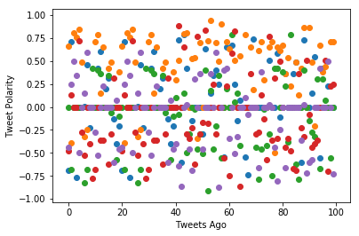
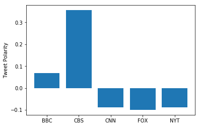

```python
import tweepy
import json
from vaderSentiment.vaderSentiment import SentimentIntensityAnalyzer
import matplotlib.pyplot as plt
import pandas as pd
```


```python
analyzer = SentimentIntensityAnalyzer()

consumer_key = "1KTRotZsZ0qa5RWSu4TPhtyOL"
consumer_secret = "M5bRlkrzdtYV8Qp96xogIfp9z9UYVvSCqrStIbD7m58qSM1BuT"
access_token = "529108805-OmkfIgcEVb013kjNaBdc20JTHDO2nRUCLis2sQkl"
access_token_secret = "enZOntET6d7ry1fnXrXwiV0jNzp5nN5UJubZFHgBPdvwO"
```


```python
# Setup Tweepy API Authentication
auth = tweepy.OAuthHandler(consumer_key, consumer_secret)
auth.set_access_token(access_token, access_token_secret)
api = tweepy.API(auth, parser=tweepy.parsers.JSONParser())

# Tweet Texts
scores = {'BBC': [],
          'CBS': [],
          'CNN': [],
          'FOXNews': [],
          'NYTimes': [],
         }

# Create a loop to iteratively run API requests
def get_score(target):
    for x in range(5):

        # Get all tweets from home feed (for each page specified)
        public_tweets = api.user_timeline(target, page=x)

        # Loop through all tweets
        for tweet in public_tweets:

            # Print Tweet
            results = analyzer.polarity_scores(tweet["text"])

            # Store Tweet in Array
            scores[target].append(results["compound"])

get_score('BBC')
get_score('CBS')
get_score('CNN')
get_score('FOXNews')
get_score('NYTimes')

df = pd.DataFrame(data=scores)
# Print the Tweet Count
plt.scatter(range(100), scores['BBC'])
plt.scatter(range(100), scores['CBS'])
plt.scatter(range(100), scores['CNN'])
plt.scatter(range(100), scores['FOXNews'])
plt.scatter(range(100), scores['NYTimes'])
plt.ylabel("Tweet Polarity")
plt.xlabel("Tweets Ago")
plt.show()
```





```python
plt.bar(['BBC', 'CBS', 'CNN', 'FOX', 'NYT'], df.mean().tolist())
plt.ylabel("Tweet Polarity")
plt.show()
```




